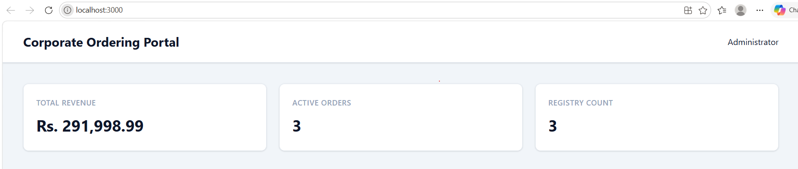
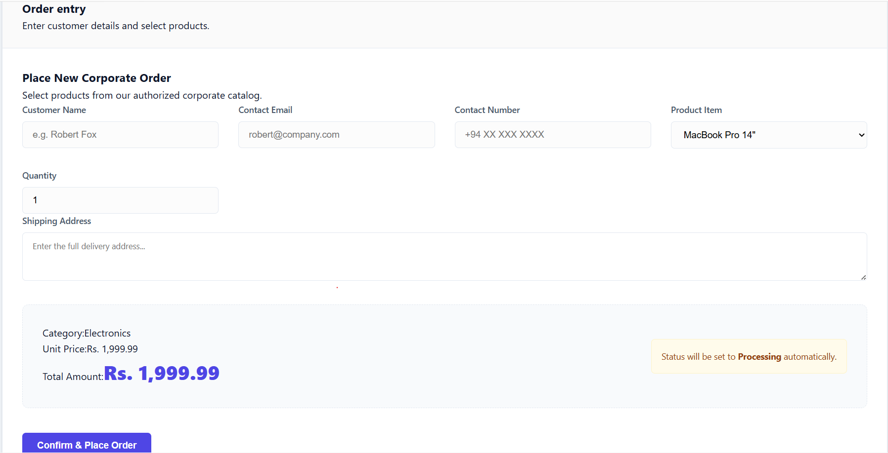
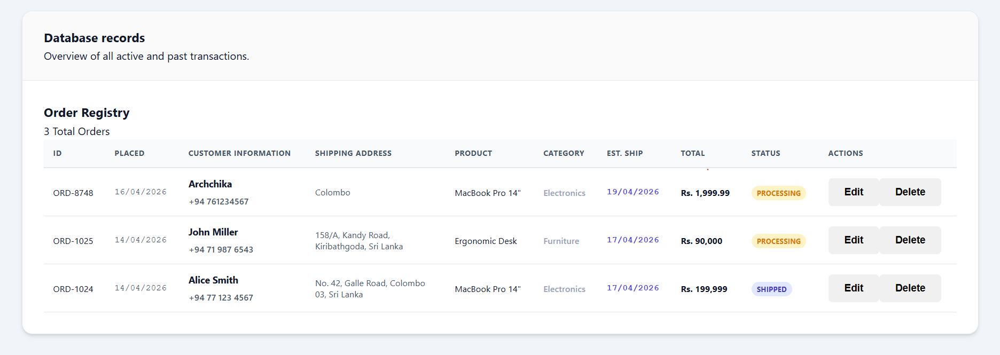
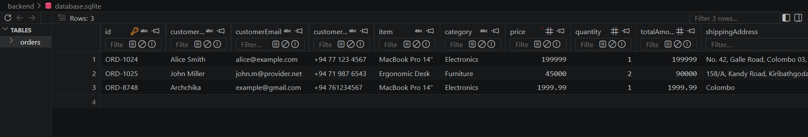

# Corporate Ordering Portal (Full-Stack)

A professional, CRUD-based corporate ordering system designed for efficiency and data persistence. Built with a modern TypeScript stack, this portal manages the full lifecycle of product orders from creation to estimated fulfillment.

## Visual Preview

### 1. Dashboard Metrics (Top)


### 2. Order Entry System (Form)


### 3. Order Registry (Database Records)


### Database Management (SQLite)


## Key Features
- **Full CRUD Persistence**: Integrated SQLite database for permanent storage of all order records.
- **High-Density Data View**: Optimized UI layout that fits complex data (including tracking dates and addresses) without horizontal scrolling.
- **Automated Business Logic**: Automated shipping estimations and total amount calculations.
- **Unit Tested**: Robust testing coverage using Vitest and Jest for core business utilities.
- **Type Safety**: Shared data models across Frontend and Backend to ensure 100% type consistency.

## Tech Stack
- **Frontend**: React (TypeScript), CSS
- **Backend**: Node.js, Express (TypeScript)
- **Database**: SQLite (better-sqlite3)
- **Testing**: Vitest (Backend), Jest/React Testing Library (Frontend)

## Project Structure
```text
├── backend/            # Express server & SQLite database
├── frontend/           # React dashboard & styles
├── shared/             # Common TypeScript interfaces
└── docs/               # Screenshots and documentation
```

## Setup & Installation

### 1. Prerequisite
Ensure you have [Node.js](https://nodejs.org/) installed on your machine.

### 2. Installation
Install dependencies for both the frontend and backend:
```bash
# Backend
cd backend && npm install

# Frontend
cd ../frontend && npm install
```

### 3. Running the Application
You need to start both the backend and the frontend:

**Step A: Start Backend**
```bash
cd backend
npm run dev
```

**Step B: Start Frontend**
```bash
cd frontend
npm start
```
The portal will be available at `http://localhost:3000`.

## Testing
We maintain a suite of unit tests for important logic.

- **Backend Tests**: `cd backend && npx vitest run`
- **Frontend Tests**: `cd frontend && npm test`

For detailed testing instructions, see [TESTING_GUIDELINES.md](./TESTING_GUIDELINES.md).

---

> [!IMPORTANT]
> **Database Location**: The database file is located at `backend/database.sqlite`. It is automatically ignored by Git.
