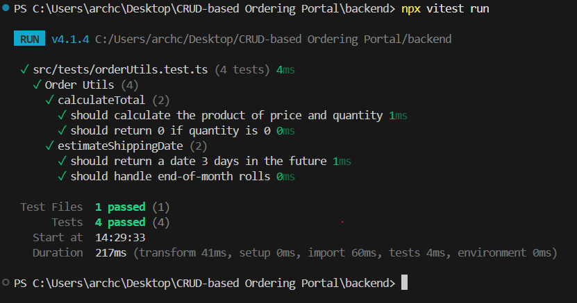
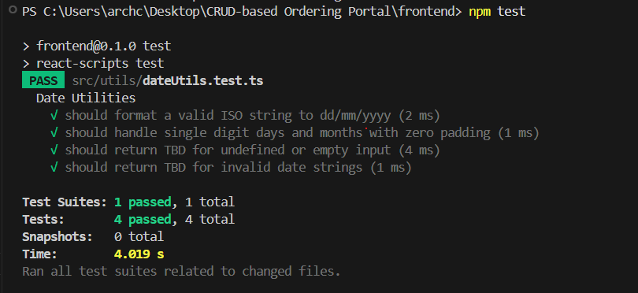

# Testing Guidelines: Corporate Ordering Portal

This document outlines the standards and procedures for maintaining high-quality code through automated testing in this repository.

## 1. Testing Frameworks
- **Frontend**: [Jest](https://jestjs.io/) + [React Testing Library](https://testing-library.com/docs/react-testing-library/intro/) (CRA built-in).
- **Backend**: [Vitest](https://vitest.dev/) (High performance, ES module native).

## 2. File Organization
- Tests should live alongside the code they test or in a `tests/` subdirectory.
- **Naming Pattern**: `[filename].test.ts` or `[filename].test.tsx`.
- **Example**: `utils/dateUtils.ts` -> `utils/dateUtils.test.ts`.

## 3. Best Practices
### Isolated Utilities
Always extract business logic (calculations, formatting, data mapping) into separate utility files. This allows for **Unit Testing** without mocking complex dependencies like Express, Database, or React components.

### Arrange-Act-Assert (AAA)
Follow the AAA pattern for readable tests:
1. **Arrange**: Set up the initial conditions and inputs.
2. **Act**: Execute the function or logic under test.
3. **Assert**: Verify that the result matches your expectation.

### Component Testing
Focus on testing **User Behavior** rather than implementation details:
- *Bad*: Testing if `state.isVisible` is true.
- *Good*: Testing if the "Order Registry" heading is visible on the screen.

## 4. Running Tests
### Frontend
```bash
cd frontend
npm test
```

### Backend
```bash
cd backend
npx vitest run
```

## 5. Mocking
- Use `vi.mock()` in Vitest for backend service isolation.
- Use `jest.mock()` for frontend API mocking.

---

## 6. Verification Evidence
> [!TIP]
> Including screenshots of passing test suites is a professional way to document the "Definition of Done" for a feature.

### Backend Test Results


### Frontend Test Results

